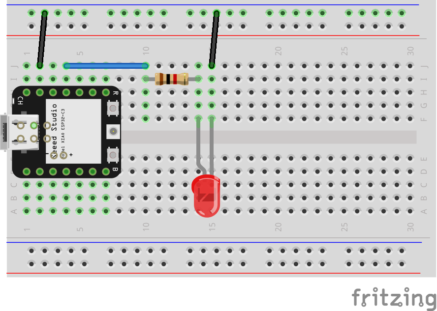

# webled

Este exemplo foi desenvolvido em MicroPython. Se baseia no exemplo em

https://sigmdel.ca/michel/ha/xiao/xiao_esp32c3_intro_en.html

Para rodar este exemplo, conecte um LED com um resitor de 1K em série entre os pinos MOSI e GND da XIAO.

